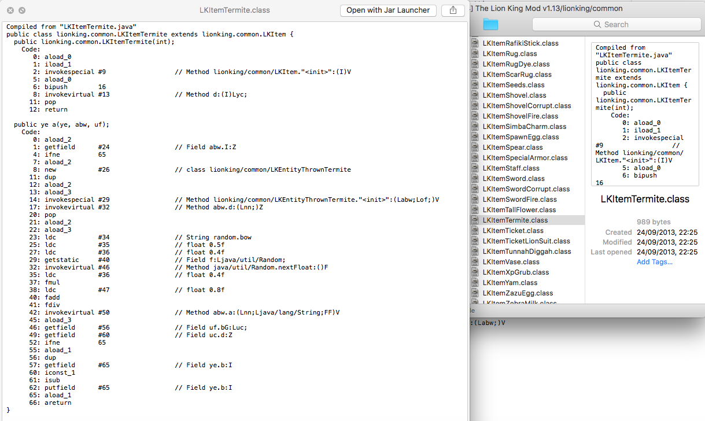

# Java Class Quick Look
Java Class Quick Look is a QuickLook plugin that lets you preview Java `.class` files as bytecode. This uses the `javap -c` command.

## Requirements
* macOS
* Java 8 installed (project expects `/Library/Java/JavaVirtualMachines/jdk1.8.0_05.jdk` as install location)

